# Manual UI De Simulacion

Este manual resume el flujo real de la app con evidencia visual.

## 1) Login y acceso inicial

1. Inicia sesion con el rol de prueba (`client@travelbox.pe`, `operator@travelbox.pe`, `admin@travelbox.pe` o `courier@travelbox.pe`).
2. Verifica que cargue el home del rol correcto.

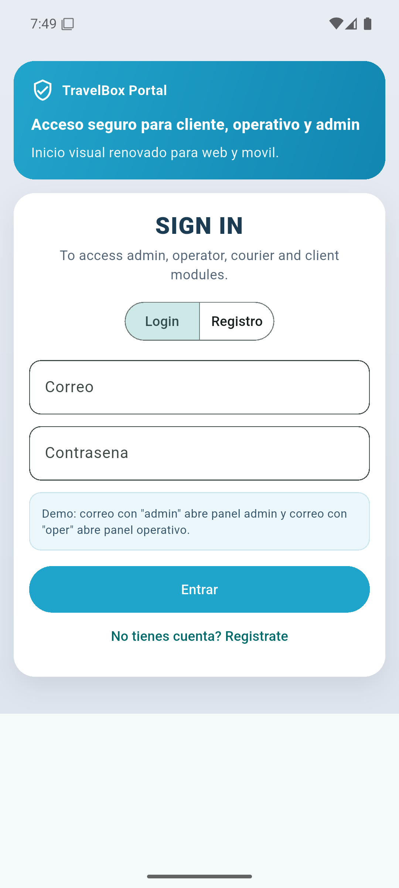

## 2) Flujo cliente: reserva y seguimiento

1. Cliente crea reserva y completa checkout.
2. Desde detalle puede revisar estado y tracking cuando aplique.
3. Si hay pago digital confirmado (tarjeta/yape/plin/wallet), el boton muestra flujo de `Reembolsar y cancelar`.

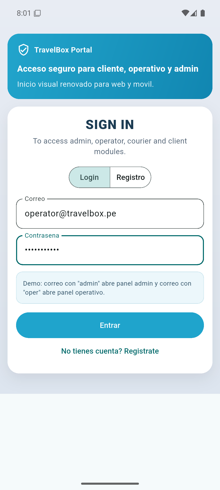
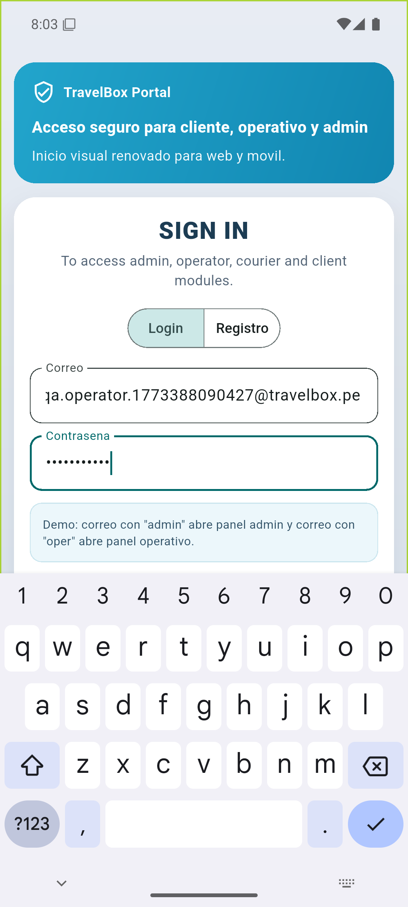
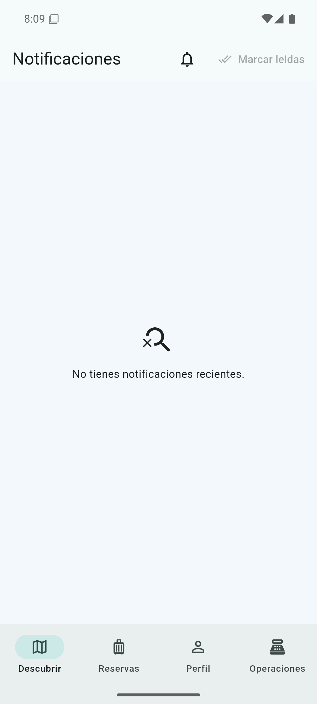

## 3) Flujo operador: check-in y logistica

1. Operador abre `Reservas operativas`.
2. Registra ingreso por QR/PIN y evidencia.
3. Solicita delivery o recojo segun estado permitido.

Validaciones aplicadas:
- Recojo solo cuando la reserva esta `CONFIRMED`.
- Delivery solo en `STORED` o `READY_FOR_PICKUP`.
- Boton `Solicitar recojo` solo se habilita si la reserva tiene `pickupRequested=true`.
- Boton `Solicitar delivery` solo se habilita si la reserva tiene `dropoffRequested=true`.
- Si ya existe una orden activa del mismo tipo, no permite duplicar.
- Si backend detecta que el cliente no solicito ese servicio, responde `409` y la UI muestra bloqueo de proceso.

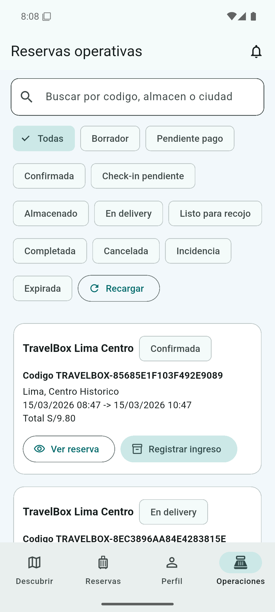
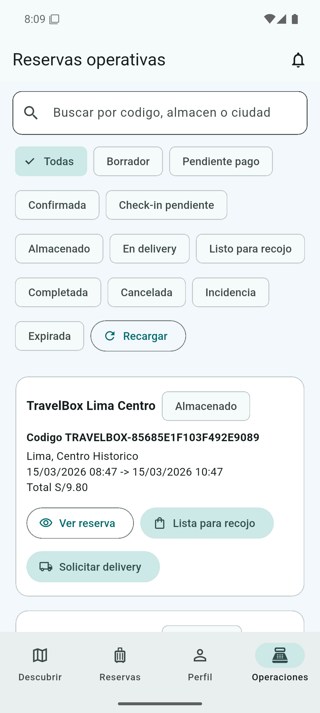
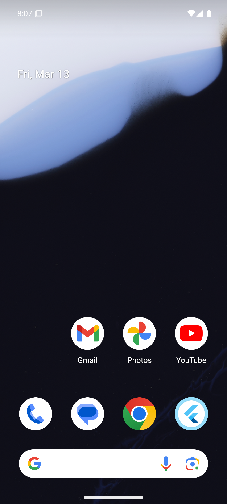

## 4) Flujo QR/PIN y entrega

1. Escaneo QR.
2. Registro de maletas/fotos.
3. Aprobacion y cierre de entrega.

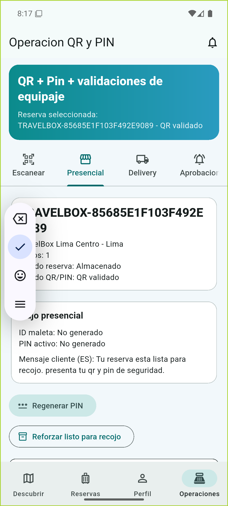
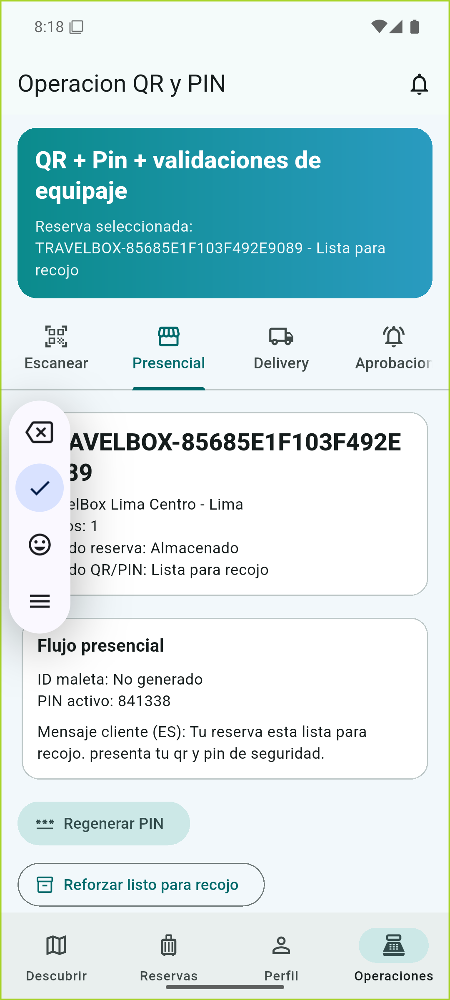
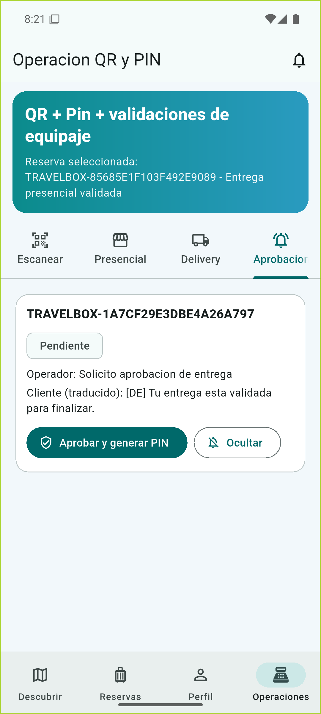

## 5) Pagos operativos (caja + reembolso)

1. Operador/admin revisa cola de pagos en caja.
2. Puede aprobar o rechazar efectivo.
3. Para pagos digitales ya confirmados, la cancelacion exige reembolso primero.

Regla extra en salida por oficina:
- Si el cliente se pasa del tiempo programado de recojo en oficina, checkout final exige pagar cargo adicional por tardanza antes de completar la entrega.

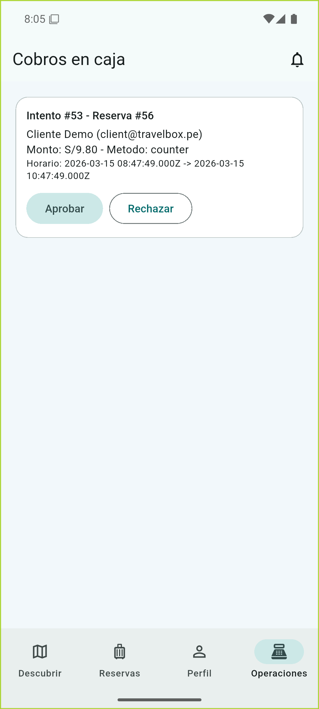
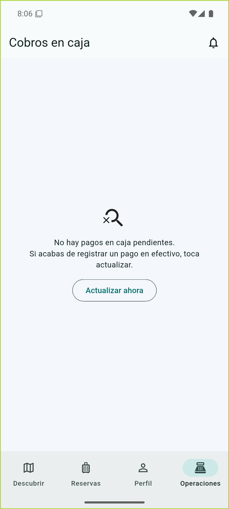

## 6) Ubicacion actual y mapa

En solicitud de recojo/delivery:
- `Ubicacion actual` ahora prioriza posicion fresca con mejor precision.
- Si la precision no es buena, puede corregirse en `Elegir en mapa`.

## 7) Reserva asistida (cliente sin app)

Para flujo de mostrador y casuisticas por sede:
- `..\TravelBox_Peru_Backend\docs\operations-casuistics-sede-manual.md`
