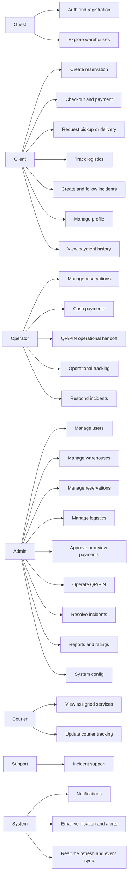
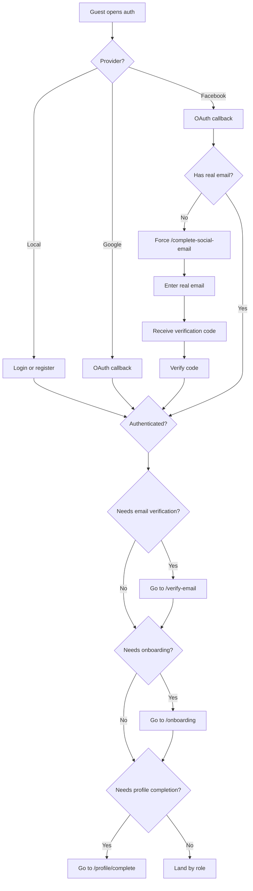
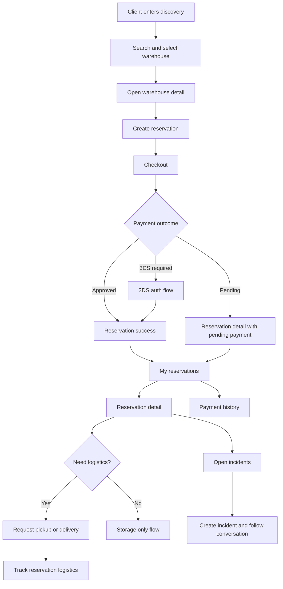
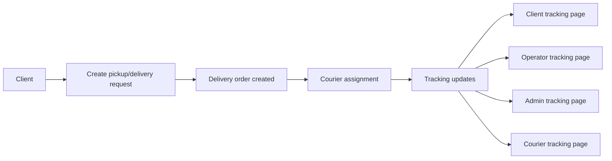
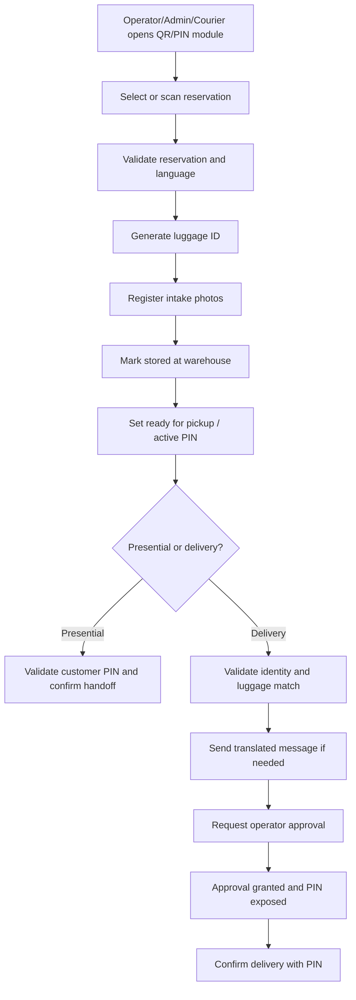
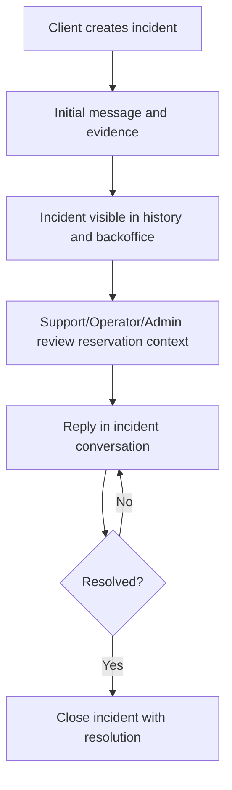
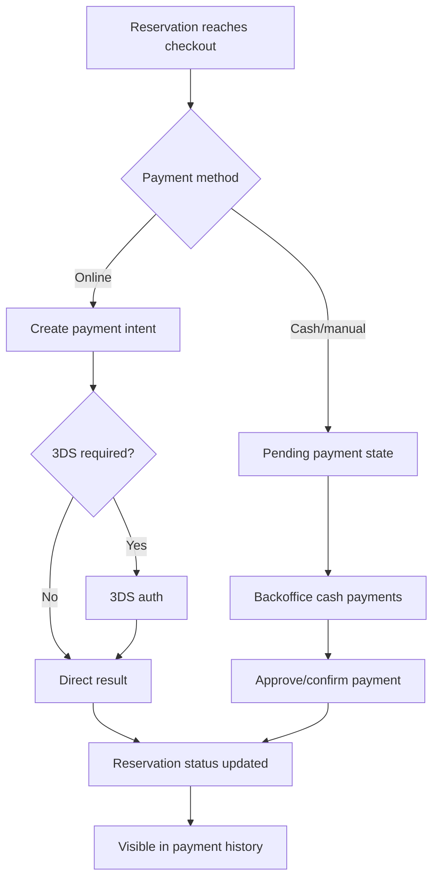
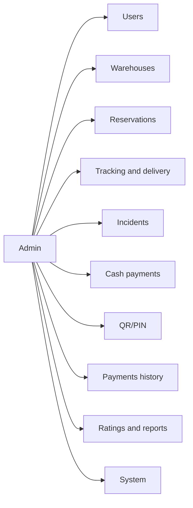

# InkaVoy App Use Cases and Validation Guide

Last updated: 2026-03-30
Source of truth used for this document:
- Frontend router and role navigation
- Frontend feature modules
- Backend bounded contexts

This document is meant to prevent skipped flows, missing permissions, and broken handoffs between modules. It can be used as:
- a use-case map
- a QA validation checklist
- a release review guide
- a role/permission reference

## 1. Actors

Primary actors in the app:
- Guest
- Client
- Client authenticated with social login pending real email completion
- Operator
- Admin
- Courier
- Support
- System

## 2. Main domains in the app

Functional domains detected from code:
- Auth and onboarding
- Discovery and warehouses
- Reservation lifecycle
- Checkout and payments
- Delivery request and logistics tracking
- QR/PIN operational handoff
- Incidents and support
- Notifications
- Profile and identity data
- Admin backoffice
- Reports and ratings

## 3. Route map by role

### Public / pre-auth
- `/auth`
- `/auth/callback`
- `/login`
- `/register`
- `/password-reset`

### Forced gated flows
- `/complete-social-email`
- `/verify-email`
- `/onboarding`
- `/profile/complete`

### Client
- `/discovery`
- `/warehouse/:warehouseId`
- `/warehouse/:warehouseId/ratings`
- `/reservation/new/:warehouseId`
- `/checkout/:warehouseId`
- `/payment/3ds-auth`
- `/reservation/success/:reservationId`
- `/reservations`
- `/reservation/:reservationId`
- `/delivery/:reservationId`
- `/tracking/:reservationId`
- `/incidents`
- `/incidents-history`
- `/payments-history`
- `/notifications`
- `/profile`
- `/profile/edit`

### Admin
- `/admin/dashboard`
- `/admin/users`
- `/admin/warehouses`
- `/admin/reservations`
- `/admin/delivery`
- `/admin/tracking`
- `/admin/tracking/:reservationId`
- `/admin/incidents`
- `/admin/cash-payments`
- `/admin/qr-handoff`
- `/admin/payments-history`
- `/admin/ratings`
- `/admin/system`

### Operator
- `/operator/panel`
- `/operator/reservations`
- `/operator/cash-payments`
- `/operator/tracking`
- `/operator/tracking/:reservationId`
- `/operator/incidents`
- `/ops/qr-handoff`
- `/qr-scan`

### Courier
- `/courier/panel`
- `/courier/services`
- `/courier/tracking/:reservationId`

### Support
- `/support/incidents`

## 4. Global routing guards

Current gate order detected in app routing:
1. User must be authenticated for private routes
2. If `needsRealEmailCompletion` -> redirect to `/complete-social-email`
3. If `needsEmailVerification` -> redirect to `/verify-email`
4. If `needsOnboarding` -> redirect to `/onboarding`
5. If `needsProfileCompletion` -> redirect to `/profile/complete`
6. Role protection:
   - admin routes require admin
   - operator routes require operational/admin access
   - support routes require support
   - courier routes require courier
   - ops routes require operator/admin/courier

This order is important for validation because a valid login does not always mean app access is complete.

## 5. High-level use-case diagram

## 6. Auth and account lifecycle

### Main use cases
- Login with email/password
- Register local account
- Password reset
- Login with Google
- Login with Facebook
- Force real-email completion for Facebook accounts without real email
- Email verification by code
- Onboarding completion
- Mandatory profile completion
- Logout

### Auth diagram

### Auth validation checklist
- Local login redirects correctly by role
- Social callback processes payload correctly under hash routing
- Facebook user without email is blocked before tutorial/discovery
- Verification code flow works after real email replacement
- Refreshing or reopening session preserves forced email completion state
- Logout clears session and does not re-enter callback flow
- Login screen does not briefly flash and then redirect incorrectly

## 7. Client booking lifecycle

### Main use cases
- Explore warehouses
- Search/filter by city, district, zone or reference
- See warehouse detail and ratings
- Create reservation
- Go to checkout
- Pay with online method / 3DS / pending flow
- See reservation success
- View my reservations
- Open reservation detail
- Request pickup or delivery
- View tracking
- Report incident
- Review payment history

### Client lifecycle diagram

### Client validation checklist
- Discovery works with and without GPS
- Warehouse detail shows correct media, rates and rating links
- Reservation creation enforces date/time/capacity constraints
- Checkout shows localized dates and correct currency
- 3DS return path returns to valid reservation state
- Pending payment reservations expose the correct next step
- Delivery request appears only when reservation state allows it
- Tracking route loads for client reservation
- Incident creation links to the correct reservation
- Client can see incident history and payment history

## 8. Delivery and logistics tracking

### Main use cases
- Request pickup or delivery for a reservation
- Generate or inspect logistics order
- View live or assisted tracking
- Show ETA, route and events
- Update courier progress
- Monitor from client, operator, admin and courier contexts

### Logistics diagram

### Logistics validation checklist
- Delivery request can be opened from reservation detail
- Backoffice tracking list loads reservations/orders correctly
- Tracking by reservation works for client
- Tracking by reservation works for operator/admin
- Tracking by reservation works for courier without forbidden reservation-detail dependency
- Map tiles render correctly with Azure Maps in all tracking contexts
- Current courier position and destination markers render
- Route fallback is visible if realtime route provider is unavailable

## 9. QR/PIN operational handoff

### Main use cases
- Scan reservation or search reservation
- Validate QR
- Generate luggage ID
- Register intake photos
- Mark luggage stored
- Prepare for pickup with PIN
- Validate identity for delivery/presential release
- Request operator approval
- Approve and generate PIN
- Complete handoff

### QR/PIN diagram

### QR/PIN validation checklist
- Header/guide collapses and does not block content
- Scan and manual search both identify the same reservation
- Bag ID generation persists
- Intake photo per bag is required where defined
- Stored/ready/pin states are reflected in reservation and case state
- Delivery approval notifications appear in approvals tab
- Presential and delivery confirmations require the proper PIN sequence

## 10. Incidents and support lifecycle

### Main use cases
- Client opens incident from reservation
- Client uploads evidence
- Incident message is translated or normalized for backoffice
- Support/operator/admin view incident list
- Open reservation and tracking from incident
- Reply within a persistent conversation
- Resolve incident

### Incident lifecycle diagram

### Incident validation checklist
- Client can create incident from reservation context
- Evidence upload works in web and mobile-compatible browsers
- Message is readable and translated where expected
- Backoffice can respond, not only resolve
- Conversation remains visible until closure
- Client sees the same conversation thread
- Resolve action updates status and blocks further inappropriate replies if required

## 11. Cash payments and payment operations

### Main use cases
- Checkout payment
- 3DS authentication
- Pending payment review
- Backoffice cash payment acceptance/confirmation
- Payment history access

### Payment diagram

### Payment validation checklist
- Checkout shows correct amounts and currency by context
- 3DS return path updates the reservation/payment state
- Pending payments show in admin/operator cash payments
- Payment history is visible for client and backoffice where expected
- Failed and pending states do not skip required approval steps

## 12. Admin backoffice use cases

### Main use cases
- Manage users
- Manage warehouses
- Manage reservations
- Manage delivery/tracking
- Manage incidents
- Cash payments
- QR/PIN operations
- Payment history
- Ratings/reports
- System settings

### Admin diagram

### Admin validation checklist
- All expected tabs/routes are accessible from admin shell
- Admin can open tracking, QR/PIN and cash payments without role mismatch
- Route guards do not incorrectly downgrade admin into operator-only experience
- Deep links from reservations and incidents open valid admin routes

## 13. Operator use cases

### Main use cases
- Operations dashboard
- Reservation operations
- Cash payment operations
- Logistics tracking
- Incident response
- QR/PIN handoff

### Operator validation checklist
- Operator landing route is `/operator/panel`
- Operator can access reservations, tracking, cash payments and incidents
- Operator cannot open admin-only routes
- QR/PIN operational flow is fully usable from operator context

## 14. Courier use cases

### Main use cases
- Open courier dashboard
- View assigned services
- Open tracking by reservation
- Update delivery progress

### Courier validation checklist
- Courier landing route is `/courier/panel`
- Courier services page lists assigned jobs
- Courier can open tracking page per assigned reservation
- Tracking does not fail because of reservation-detail permissions
- Courier can update progress and changes are reflected in tracking/history

## 15. Support use cases

### Main use cases
- Access support incidents only
- Review context
- Reply and resolve

### Support validation checklist
- Support user is forced into `/support/incidents`
- Support cannot access admin/operator/courier private modules
- Support can still access notifications and profile

## 16. Role vs capability matrix

| Capability | Guest | Client | Operator | Admin | Courier | Support |
|---|---|---|---|---|---|---|
| Login/register | Yes | N/A | N/A | N/A | N/A | N/A |
| Discovery | Limited/public entry | Yes | Redirected by role | Redirected by role | Redirected by role | Redirected by role |
| Create reservation | No | Yes | No | No | No | No |
| Checkout | No | Yes | No | No | No | No |
| Payment history | No | Yes | Backoffice history | Backoffice history | No | No |
| Incidents create | No | Yes | No | No | No | No |
| Incidents respond | No | Conversation view only | Yes | Yes | No | Yes |
| Logistics tracking | No | Yes | Yes | Yes | Yes | Limited by route policy |
| QR/PIN | No | No | Yes | Yes | Allowed by route policy | No |
| Cash payments | No | No | Yes | Yes | No | No |
| User admin | No | No | No | Yes | No | No |
| Warehouse admin | No | No | No | Yes | No | No |

## 17. Release validation suite

Use this before production deploys:

### Auth
- Local login
- Google login
- Facebook login with real email
- Facebook login without real email
- Email verification
- Password reset
- Logout and session restore

### Client
- Discovery
- Warehouse detail
- Reservation create
- Checkout
- 3DS
- Reservation success
- Reservation detail
- Delivery request
- Tracking
- Incident create/history
- Payment history
- Profile edit

### Operations
- Admin routes
- Operator routes
- Courier routes
- Support routes
- Deep links to tracking from incidents/reservations
- QR/PIN full flow
- Cash payment flow

### Logistics/maps
- Discovery map
- Current location centering
- Tracking map
- Courier tracking
- Warehouse location picker

### Incident flow
- Evidence upload
- Conversation reply
- Resolve
- Client visibility after reply

## 18. Known high-risk validation points

These are the areas most likely to regress because they cross modules:
- Social auth callback and redirect sequencing
- Forced real-email completion before onboarding
- Reservation -> checkout -> payment -> success state transitions
- Reservation -> delivery request -> tracking linkage
- Reservation -> incident -> reply -> resolution
- Reservation -> QR/PIN -> delivery approval -> completion
- Admin/operator/courier route mismatches
- Map provider changes and geolocation in web

## 19. Suggested next documentation artifacts

If you want this to become a stronger QA package, the next useful files would be:
- `docs/test-scenarios-auth.md`
- `docs/test-scenarios-reservations.md`
- `docs/test-scenarios-operations.md`
- `docs/permission-matrix.md`
- `docs/state-machine-reservation.md`

